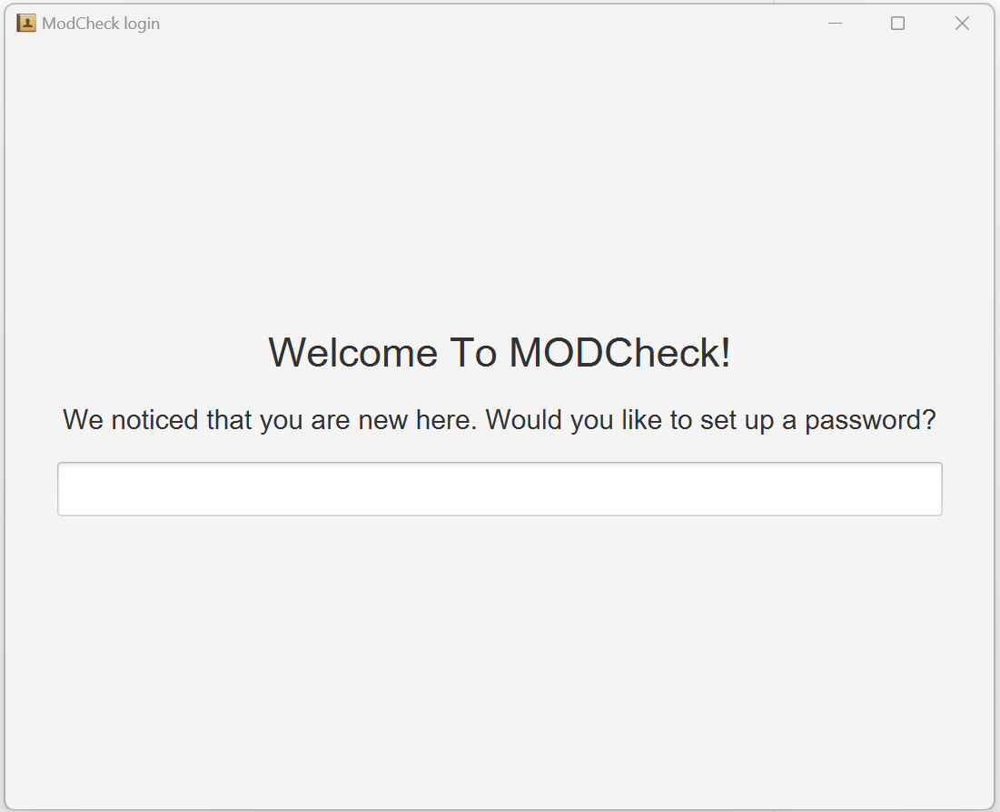
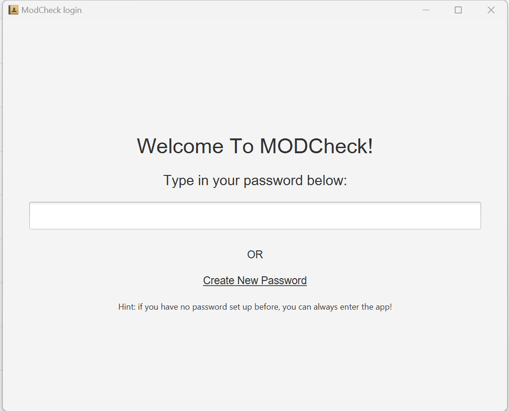
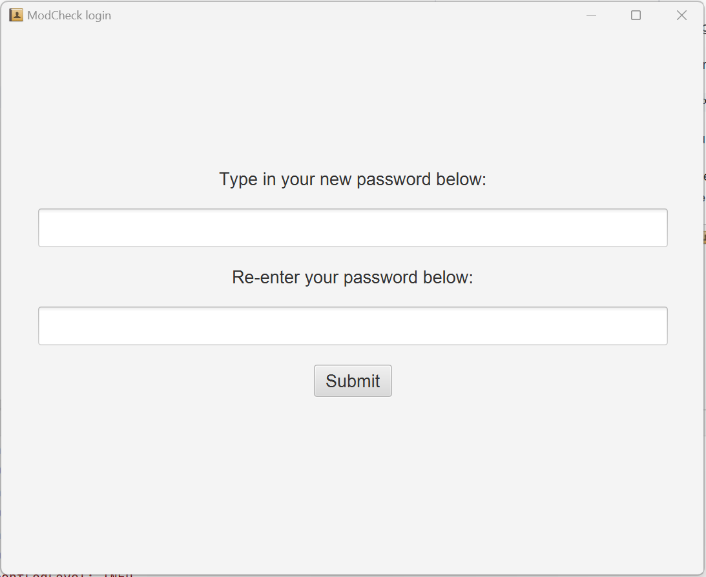
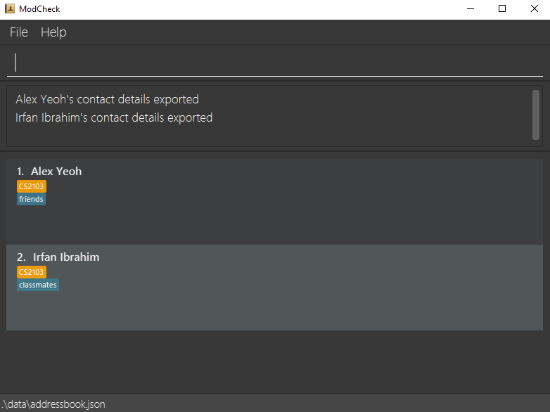
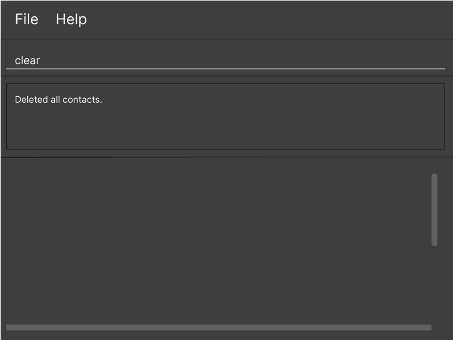
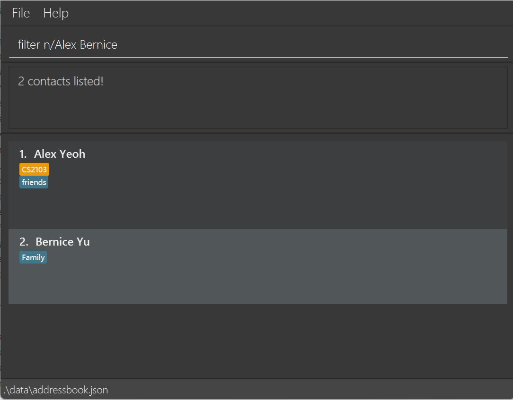
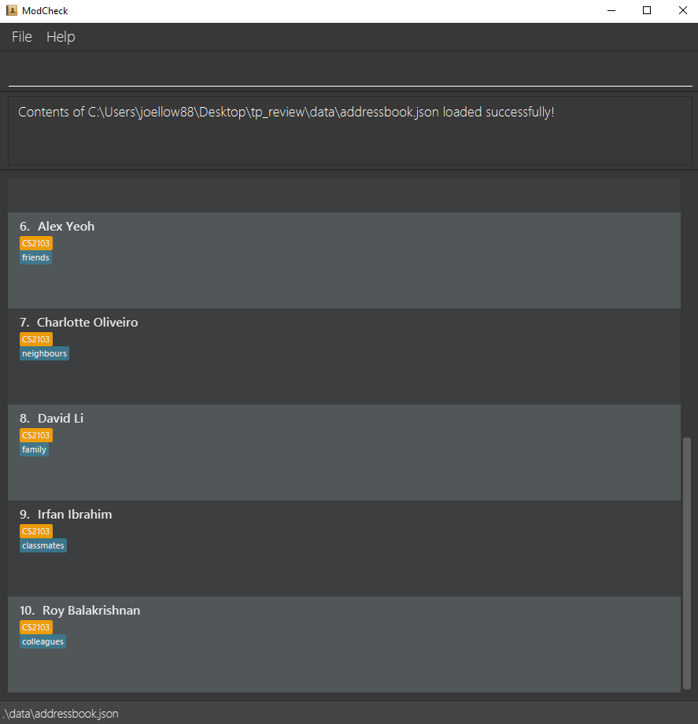

MODCheck is a **desktop app for managing contacts, optimized for use via a Command Line Interface** (CLI) while still having the benefits of a Graphical User Interface (GUI). If you can type fast, MODCheck can get your contact management tasks done faster than traditional GUI apps.

* Table of Contents
{:toc}

--------------------------------------------------------------------------------------------------------------------

## Quick start

1. Ensure you have Java `11` or above installed in your Computer.
2. The first GUI you will encounter is the `ModCheck Login`.
3. If it is the first time that you are using MODCheck, you will be greeted with the GUI below. 
   
   

       <em>First Time User Welcome GUI</em>
   

    
   
4. Enter `yes` if you want to create a password or `no` if you want to continue to MODCheck main application. Further explanation on the `Login` feature will be described further down under `Features`.
5. You will be greeted with one of GUI shown below that represents the `loading` screen before entering MODCheck's main application depending on the choice you have made earlier.
   
   

   <em>Default Loading GUI</em>
   

    

   
   

   <em>Password Created Successfully Loading GUI</em>
   

    
   
6. A GUI similar to the below should appear in a few seconds. Note how the app contains some sample data. 
   
    

    <em>MODCheck Main GUI</em>
    

     

7. Type the command in the command box and press Enter to execute it. e.g. typing **`help`** and pressing Enter will open the help window. 
   Some example commands you can try:

   * `list` : Lists all contacts.

   * `add n/John Doe p/98765432 e/johnd@example.com d/John street, block 123, #01-01` : Adds a contact named `John Doe` to ModCheck.

   * `delete 3` : Deletes the 3rd contact shown in the current list.

   * `clear` : Deletes all contacts.

   * `exit` : Exits the app.

8. Refer to the [Features](#features) below for details of each command.

--------------------------------------------------------------------------------------------------------------------

## Features

**:information_source: Notes about the command format:** 

* Words in `UPPER_CASE` are the parameters to be supplied by the user. 
  e.g. in `add n/NAME`, `NAME` is a parameter which can be used as `add n/John Doe`.

* Items in square brackets are optional. 
  e.g `n/NAME [t/TAG]` can be used as `n/John Doe t/friend` or as `n/John Doe`.

* Items with `…`​ after them can be used multiple times including zero times. 
  e.g. `[t/TAG]…​` can be used as ` ` (i.e. 0 times), `t/friend`, `t/friend t/family` etc.

* Parameters can be in any order. 
  e.g. if the command specifies `n/NAME p/PHONE_NUMBER`, `p/PHONE_NUMBER n/NAME` is also acceptable.

* If a parameter is expected only once in the command but you specified it multiple times, only the last occurrence of the parameter will be taken. 
  e.g. if you specify `p/12341234 p/56785678`, only `p/56785678` will be taken.

* Extraneous parameters for commands that do not take in parameters (such as `help`, `list`, `exit` and `clear`) will be ignored. 
  e.g. if the command specifies `help 123`, it will be interpreted as `help`.

### Logging in

Login to MODCheck with given passsword that may be empty.

Format: `[Password]`

`[Password]`: Password of user.

> :bulb:  **Tip:** User can leave the textbox empty and press `Enter` to enter inside MODCheck's main application if user did not create a password to secure MODCheck.

<em>Default Login GUI</em>

 

### Creating Password

Creates a password to secure MODCheck from other unwanted users

<em>Create Password GUI</em>

 

Format: `[Password]`

`[Password]`: Password of user.

### Viewing help : `help`

Shows a message explaning how to access the help page.

Format: `help`

### Adding a person: `add`

Adds a person contact details to ModCheck.

Compulsory Field:
* `n/` : name of the person

Additional Fields:
* `d/` : description of the person
* `e/` : email
* `p/` : phone number
* `t/` : tags 
* `m/` : module codes

> :bulb:  **Tip:** A person can have any number of tags or modules (including 0). The order of the fields is not important.

Examples:
* `add n/John d/Important friend e/leomessi@psg.com p/98101010`
* `add n/Gray d/Coolest Prof ever e/SIUUUUUU@gmail.com p/98070707 t/Prof m/CS2103 m/CS3230`

### Listing all persons : `list`

Shows a list of all persons in ModCheck.

Format: `list`

### Viewing a person's contact details : `view`

View a person's contact details.

Format: `view <index>`

Examples: 
* `view 1` returns the contact details of the first person in the list
* `view 1 3` returns the contact details of the first and third person in the list

### Exporting selected person's contact details : `export`

Export a person's contact details.

Format: `export <index>`

Examples:
* `export 1` exports the contact details of the first person in the list
* `export 1 4` exports the contact details of the first and fourth person in the list

Exported contacts will be stored inside a Json file under the `exports` folder found in the same directory as ModCheck

### Editing a person : `edit`

Edits an existing person in ModCheck.

Format: `edit INDEX [n/NAME] [p/PHONE] [e/EMAIL] [a/ADDRESS] [t/TAG]…​` or `edit NAME [n/NAME] [p/PHONE] [e/EMAIL] [a/ADDRESS] [t/TAG]…​`

* Edits the person at the specified `INDEX` or `NAME`. The index refers to the index number shown in the displayed person list. The index **must be a positive integer** 1, 2, 3, …​
* At least one of the optional fields must be provided.
* Existing values will be updated to the input values.
* When editing tags, the existing tags of the person will be removed i.e adding of tags is not cumulative.
* You can remove all the person’s tags by typing `t/` without
    specifying any tags after it.

Examples:
*  `edit 1 p/91164512` Edits the phone number of the 1st person to be `91164512`.
*  `edit 3 p/90011009 e/bernice512@example.com` Edits the phone number and email address of the 3rd person to be 
   90011009 and bernice512@example.com respectively

### Locating persons by name: `find`

Finds persons whose names contain any of the given keywords.

Format: `find KEYWORD [MORE_KEYWORDS]`

* The search is case-insensitive. e.g `hans` will match `Hans`
* The order of the keywords does not matter. e.g. `Hans Bo` will match `Bo Hans`
* Only the name is searched.
* Only full words will be matched e.g. `Han` will not match `Hans`
* Persons matching at least one keyword will be returned (i.e. `OR` search).
  e.g. `Hans Bo` will return `Hans Gruber`, `Bo Yang`

Examples:
* `find John` returns `john` and `John Doe`
* `find alex david` returns `Alex Yeoh`, `David Li` 
  

### Deleting a person : `delete`

Deletes the specified person from ModCheck.

Format: `delete INDEX` or `delete INDEXES` or `delete NAME`

* Deletes the person at the specified `INDEX`.
* The index refers to the index number shown in the displayed person list.
* The index or indexes **must be a positive integer** …​

Examples:
* `list` followed by `delete 3` deletes the 3rd person in the list.
* `list` followed by `delete 1,2,3` deletes the 1st, 2nd and 3rd person in the list.
* `list` followed by `delete Betsy` deletes Betsy if there is only one Betsy in the list.

### Clearing all entries : `clear`

Clears all entries from ModCheck.

Format: `clear`

Examples: 
* `list` followed by `clear` deletes all the contacts in the list.
  

### Exiting the program : `exit`

Exits the program.

Format: `exit`

### Saving the data

MODCheck data are saved in the hard disk automatically after any command that changes the data. There is no need to save manually.

### Editing the data file

MODCheck data are saved as a JSON file. Advanced users are welcome to update data directly by editing that data file.

:exclamation: **Caution:**
If your changes to the data file makes its format invalid, MODCheck will discard all data and start with an empty data file at the next run.

### Filtering contacts

Filters the contacts based on the arguments provided.

Formats: 
1. `filter n/NAME`
2. `filter p/PHONE_NUMBER`
3. `filter e/EMAIL_ADDRESS`
4. `filter d/DESCRIPTION`
5. `filter t/TAG`

Examples:

* `filter n/Alex` returns `1 contacts listed!`
* `filter n/Alex Bernice` returns `2 contacts listed!`
* The search is case-insensitive. e.g hans will match Hans
* The order of the keywords does not matter. e.g. Hans Bo will match Bo Hans
* Only the name is searched.
* Only full words will be matched e.g. Han will not match Hans
* Persons matching at least one keyword will be returned (i.e. OR search). e.g. Hans Bo will return Hans Gruber, Bo Yang

  
* `filter p/91031282` returns `1 contacts listed!`

  
* `filter e/royb@example.com` returns `1 contacts listed!`

  
* `filter d/helpful` returns `1 contacts listed!`
* `filter d/helpful Newgate` returns `2 contacts listed!`
* The search is case-sensitive. e.g Helpful will match Helpful and not helpful
* The order of the keywords does not matter. e.g. Helpful Newgate will match Newgate Helpful
* Only the description is searched.
* Only full words will be matched.
* Contacts matching at least one keyword will be returned (i.e. OR search). e.g. Helpful roommate will return Helpful, Helpful friend, lazy roomate

  
* `filter t/family` returns `1 contacts listed`
* `filter t/family t/friends t/classmates` returns `3 contacts listed!`
* 

### Undo past commands

Undoes previous commands that modified ModCheck.
Undo will only undo commands that have successfully modified the data in ModCheck. For example, a successful `add`,
`edit`, or `delete` command can be undone by the undo command.
Any commands that does not modify the data in ModCheck will NOT be undone. This includes `view`, `find`, and other
similar commands. Any command that would have modified the data in ModCheck, but was unsuccessful in doing so (eg:
`add` duplicate person), will NOT be undone.

Chaining of a few undo commands is supported. Once the undo limit has been reached, the error message `No command to
undo!` will be shown.

Format: `undo`

Use `redo` to reapply the changes undone by undo.

### Load another data file

`Load` the contacts in another ModCheck data file into the user's ModCheck.
`Load` will open up a file chooser window, where the user can select the desired json file to be loaded.
Only json files that are generated by ModCheck can be successfully loaded. If a file that ModCheck is unable to read 
is loaded, an error will be shown.

The user also has the option to directly specify the file path to be loaded in the text box. The use of the command 
in this way is not recommended.

The data files that are ModCheck-readable can be obtained through: 
1. use of `export` command
2. copying the data file in data/addressbook.json

Note: If there are duplicate persons (ie: persons with the same name but possibly different fields) in ModCheck and the 
data file to be loaded, the person will be <b>ignored</b> instead of <b>overwritten</b>. 

Format: `load` OR `load <path>`

### Dark/Light Mode

Choose your favourite theme !

`light` To change to light mode.

`dark`  To change to dark mode. (default)

--------------------------------------------------------------------------------------------------------------------

## FAQ

**Q**: How do I transfer my data to another Computer? 
**A**: Install the app in the other computer. `load` the contents of the previous data file into your new ModCheck.

--------------------------------------------------------------------------------------------------------------------

## Command summary

| Action     | Format, Examples                                                                                                                                                                                                                                                                      |
|------------|---------------------------------------------------------------------------------------------------------------------------------------------------------------------------------------------------------------------------------------------------------------------------------------|
| **Add**    | `add n/NAME p/PHONE_NUMBER e/EMAIL a/ADDRESS [t/TAG]…​`   e.g., `add n/James Ho p/22224444 e/jamesho@example.com a/123, Clementi Rd, 1234665 t/friend t/colleague`                                                                                                                 |
| **View**   | `view INDEX`  e.g., `view 2`                                                                                                                                                                                                                                                       |
| **Clear**  | `clear`                                                                                                                                                                                                                                                                               |
| **Delete** | `delete INDEX` or `delete INDEXES` or `delete NAME`   e.g., `delete 3` or `delete 1,2,3` or `delete James`                                                                                                                                                                         |
| **Edit**   | `edit {INDEX or NAME} [n/NAME] [p/PHONE_NUMBER] [e/EMAIL] [a/ADDRESS] [t/TAG]…​`  e.g.,`edit 2 n/James Lee e/jameslee@example.com` or `edit James e/jameslee@example.com`                                                                                                          |
| **Find**   | `find KEYWORD [MORE_KEYWORDS]`  e.g., `find James Jake`                                                                                                                                                                                                                            |
| **List**   | `list`                                                                                                                                                                                                                                                                                |
| **Help**   | `help`                                                                                                                                                                                                                                                                                |
| **Filter** | `filter n/NAME`   `filter p/PHONE_NUMBER`  `filter e/EMAIL_ADDRESS`   `filter d/DESCRIPTION`   `filter t/TAG`   e.g. `filter n/Alex`   e.g. `filter p/91031282`   e.g. `filter e/royb@example.com`   e.g. `filter d/helpful`   e.g. `filter t/family`   |
| **Undo**   | `undo`                                                                                                                                                                                                                                                                                |
| **Redo**   | `redo`                                                                                                                                                                                                                                                                                |
| **Load**   | `load` OR `load <path>`                                                                                                                                                                                                                                                               |
| **Export** | `export INDEX`  e.g., `export 2`                                                                                                                                                                                                                                               |
